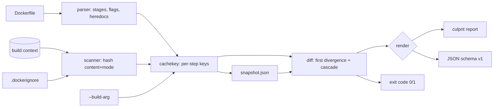

# buildbust

[English](README.md) | [中文](README.zh.md) | [日本語](README.ja.md)

[](LICENSE) [](go.mod) [](CHANGELOG.md)  [](CONTRIBUTING.md)

**buildbust：どのファイル・どの Dockerfile 行が Docker ビルドキャッシュを壊したのかを正確に説明する、オープンソースのゼロ依存 CLI——ビルドコンテキストを命令ごとにハッシュ化し、決定的な犯人レポートをオフラインで届ける。**


```bash
git clone https://github.com/JaydenCJ/buildbust && cd buildbust
go build -o buildbust ./cmd/buildbust    # single static binary, stdlib only
go install ./cmd/buildbust               # optional: put buildbust on your PATH
```

> プレリリースについて：v0.1.0 はまだどのパッケージレジストリにも公開されていません。上記の手順でソースからビルドしてください（Go ≥1.22 であれば可）。

## なぜ buildbust なのか？

Dockerfile を持つチームなら誰もが知っている儀式がある：昨日まで全部キャッシュに当たっていたビルドが今日は 9 レイヤーも作り直され、CI の課金時間が燃え、誰かが「たぶんあの COPY だろ」とつぶやいて、おまじない感覚で `.dockerignore` にもう 1 行足す。手元のツールは*なぜ*に答えられない：`docker build --progress=plain` はステップ 7 がミスしたこと*だけ*を告げ、`COPY src/ ./src/` 配下の 3,000 ファイルのどれが変わったのかは決して言わない；`docker history` や `dive` はすでにビルドしたイメージをレイヤーサイズ込みで解剖するが、キャッシュキーには一言も触れない；BuildKit のキャッシュ内部はオフラインでは覗けない。buildbust は逆側から攻める：ビルダー自身の無効化ルール——命令ごとのキー、各 COPY/ADD が実際に取り込むファイルの内容+パーミッションのハッシュ、ARG のスコープ、`.dockerignore` の意味論、ステージ間の `--from` 依存辺——をオフラインで再導出してスナップショットに記録し、次の実行で最初に分岐したステップ、新旧ダイジェスト付きの正確なファイル、そして巻き添えで再ビルドされる全レイヤーを名指しする。

| | buildbust | docker build --progress=plain | docker history | dive |
|---|---|---|---|---|
| 無効化の原因ファイルを名指し（ダイジェスト付き） | ✅ | ❌ | ❌ | ❌ |
| 最初のミスの Dockerfile 行とステップを特定 | ✅ | ⚠️ ステップのみ、ビルド実行中 | ❌ | ❌ |
| --build-arg と .dockerignore の影響を説明 | ✅ | ❌ | ❌ | ❌ |
| マルチステージ `--from` 辺をまたぐ波及範囲 | ✅ | ❌ | ❌ | ❌ |
| オフライン動作、Docker デーモン不要 | ✅ | ❌ | ❌ | ⚠️ イメージが必要 |
| CI 向けの機械可読レポート | ✅ JSON + 終了コード | ❌ ログ | ⚠️ | ⚠️ |
| ランタイム依存 | 0 | デーモン | デーモン | Go アプリ + イメージ |

<sub>2026-07-12 時点で確認：buildbust が import するのは Go 標準ライブラリのみ。レイヤー可視化ツールはビルド済みイメージを要求するため、代金を払い終えた後の再ビルドしか説明できない。</sub>

## 主な機能

- **決定的な犯人レポート** —— `explain` は最初にキャッシュミスしたステップとその Dockerfile 行を名指しし、COPY/ADD については変更されたファイルを正確に提示：変更・追加・削除・`chmod` のみ、それぞれ旧→新の sha256 ダイジェスト付き。
- **ビルダー本物のキーモデルをオフラインで** —— 解決済みテキストからの命令ごとのキー、内容+パーミッションのファイルハッシュ（Docker と同じく mtime は無視）、ステージ ARG 値が乗る RUN キー、heredoc 本文も算入；BuildKit との正直な差異まで含めて [docs/cache-model.md](docs/cache-model.md) に文書化。
- **咎めるだけでなく波及範囲も** —— 各ステージで何ステップが再ビルドされるかを可視化。`COPY --from` / `RUN --mount=from=` の依存辺で巻き込まれる下流ステージも、まだキャッシュに当たる部分も見える。
- **--build-arg のフォレンジック** —— 変更された arg は、それを最初に消費する RUN の責任として報告される（Docker の実際の挙動どおり）。証拠は `name: "old" → "new"` 形式で、ARG 行のせいにはしない。
- **.dockerignore を熟知** —— 「最後にマッチしたものが勝つ」完全な意味論、`!` による再包含と `**` に対応、BuildKit の `<Dockerfile>.dockerignore` 優先順位を踏襲。パターン編集がファイルを出し入れした場合は容疑フラグを立てる。
- **設計から CI 対応** —— 安定した JSON（`schema_version: 1`）、キャッシュ破壊時は終了コード 1、同じ実行内で `--update` によるベースライン更新、git に優しいスナップショットファイル。
- **ゼロ依存・完全オフライン** —— Go 標準ライブラリのみ。デーモンなし、レジストリなし、テレメトリは永遠になし。

## クイックスタート

```bash
# fabricate a demo context (two-stage Node-style app with .dockerignore)
bash examples/make-demo-context.sh /tmp/buildbust-demo && cd /tmp/buildbust-demo
buildbust snapshot .                       # record the baseline
echo '// retry logic' >> src/lib/util.js   # someone edits one file…
buildbust explain .                        # …who busted the cache?
```

実際にキャプチャした出力：

```text
buildbust explain — Dockerfile Dockerfile, context .

CACHE BUSTED at step 7/11 — stage "build", line 8

    8 | COPY src/ ./src/

  cause: build context changed under COPY sources [src]
    ~ modified      src/lib/util.js   6eff59ffb1c7 → 417cc1b60cd0

  blast radius: 4 of 11 steps rebuild, 7 stay cached
    stage build        steps 7-8    2 steps
    stage stage-2      steps 10-11  2 steps   via COPY --from=build (line 12)
```

各 COPY/ADD のキャッシュキーに何が入っているかを尋ねる（`buildbust files`、実際の出力）：

```text
buildbust files — Dockerfile Dockerfile, context .

step 2  line 2  COPY package.json package-lock.json ./
  2 files, 70 B, digest 21560688cd8f
    0644  package-lock.json
    0644  package.json

step 6  line 7  COPY --from=deps /node_modules ./node_modules
  copies from stage "deps" (no context files)

step 7  line 8  COPY src/ ./src/
  2 files, 163 B, digest 6a94136b4496
    0644  src/lib/util.js
    0644  src/server.js

step 10  line 12  COPY --from=build /dist /srv/app
  copies from stage "build" (no context files)
```

## CLI リファレンス

`buildbust <snapshot|explain|files|version> [flags] [context]` —— 終了コード：0 キャッシュ健在、1 キャッシュ破壊、2 用法エラー、3 実行時エラー。

| フラグ | デフォルト | 効果 |
|---|---|---|
| `-f`, `--file` | `<context>/Dockerfile` | Dockerfile のパス |
| `--dockerignore` | 自動検出 | ignore ファイル（BuildKit の探索順） |
| `--build-arg NAME=val` | — | ビルド時変数（繰り返し可；決定性のためプロセス環境は決して読まない） |
| `-o`（snapshot） | `<context>/.buildbust.json` | スナップショットの出力先 |
| `--against`（explain） | `<context>/.buildbust.json` | 比較対象のベースライン |
| `--format`（explain、files） | `text` | `text` または `json` |
| `--update`（explain） | オフ | 説明後にベースラインを書き直す |

スナップショットはただのインデント付き JSON：Dockerfile の隣にコミットすれば、`explain` はレビュー道具になる（「この PR は deps レイヤーを壊す」）。buildbust は自分のコンテキストスキャンからスナップショットファイルを常に除外するので、自分自身を犯人にすることは決してない。

## 検証

このリポジトリは CI を同梱しません。上記の主張はすべてローカル実行で検証されます：

```bash
go test ./...            # 90 deterministic tests, offline, < 5 s
bash scripts/smoke.sh    # end-to-end CLI check, prints SMOKE OK
```

## アーキテクチャ



## ロードマップ

- [x] v0.1.0 —— Dockerfile パーサー（heredoc、パーサーディレクティブ、flags）、オフラインのキャッシュキーモデル、`.dockerignore` エンジン、snapshot/explain/files サブコマンド、ステージ間の波及範囲、90 テスト + smoke スクリプト
- [ ] `--since` git モード：スナップショットを保存せずに 2 つの commit 間のキャッシュ破壊を説明
- [ ] 展開構文で BuildKit の文字列操作に対応（`${V#prefix}`、`${V%suffix}`）
- [ ] レイヤーサイズ注記：デーモンが使えるとき犯人レポートを `docker history` の出力と結合
- [ ] ウォッチモード：Dockerfile 執筆中にファイル変更のたび再説明
- [ ] レジストリのダイジェスト固定チェック（オプトイン、唯一のネットワーク機能——デフォルトはオフ）

完全な一覧は [open issues](https://github.com/JaydenCJ/buildbust/issues) を参照してください。

## コントリビュート

Issue・ディスカッション・PR を歓迎します —— ローカルのワークフロー（フォーマット、vet、テスト、`SMOKE OK`）は [CONTRIBUTING.md](CONTRIBUTING.md) を参照。入門向けタスクには [good first issue](https://github.com/JaydenCJ/buildbust/issues?q=is%3Aissue+is%3Aopen+label%3A%22good+first+issue%22) のラベルが付いており、設計の議論は [Discussions](https://github.com/JaydenCJ/buildbust/discussions) で行われています。

## ライセンス

[MIT](LICENSE)
