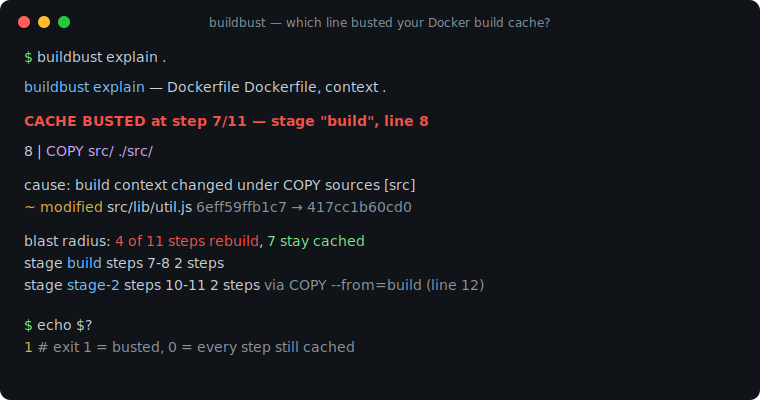
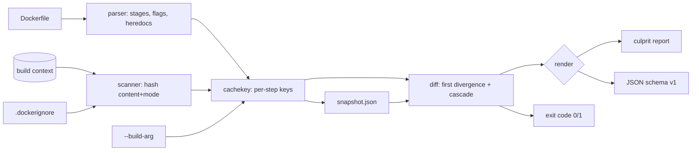

# buildbust

[English](README.md) | [中文](README.zh.md) | [日本語](README.ja.md)

[](LICENSE) [](go.mod) [](CHANGELOG.md)  [](CONTRIBUTING.md)

**buildbust：an open-source, zero-dependency CLI that explains exactly which file or Dockerfile line busted your Docker build cache — it hashes the build context per instruction and hands you a deterministic culprit report, offline.**



```bash
git clone https://github.com/JaydenCJ/buildbust && cd buildbust
go build -o buildbust ./cmd/buildbust    # single static binary, stdlib only
go install ./cmd/buildbust               # optional: put buildbust on your PATH
```

> Pre-release: v0.1.0 is not tagged on a package registry yet; build from source as above (any Go ≥1.22).

## Why buildbust?

Every team with a Dockerfile knows the ritual: a build that was fully cached yesterday rebuilds nine layers today, CI minutes burn, and someone mutters "probably the COPY" before cargo-culting another line into `.dockerignore`. The tooling you already have cannot answer *why*: `docker build --progress=plain` tells you *that* step 7 was a miss, never which of the 3,000 files under `COPY src/ ./src/` changed; `docker history` and `dive` dissect the image you already built, layer sizes and all, but say nothing about cache keys; and BuildKit's cache internals are not inspectable offline. buildbust attacks the problem from the other side: it re-derives the builder's own invalidation rules — per-instruction keys, content+mode hashes of exactly the files each COPY/ADD pulls in, ARG scoping, `.dockerignore` semantics, cross-stage `--from` edges — records a snapshot, and on the next run names the first diverging step, the exact file with old and new digests, and every layer that rebuilds as a consequence.

| | buildbust | docker build --progress=plain | docker history | dive |
|---|---|---|---|---|
| Names the exact invalidating file (with digests) | ✅ | ❌ | ❌ | ❌ |
| Pins the Dockerfile line and step of the first miss | ✅ | ⚠️ step only, during a build | ❌ | ❌ |
| Explains --build-arg and .dockerignore effects | ✅ | ❌ | ❌ | ❌ |
| Blast radius across multi-stage `--from` edges | ✅ | ❌ | ❌ | ❌ |
| Works offline, without a Docker daemon | ✅ | ❌ | ❌ | ⚠️ needs an image |
| Machine-readable report for CI | ✅ JSON + exit codes | ❌ logs | ⚠️ | ⚠️ |
| Runtime dependencies | 0 | daemon | daemon | Go app + image |

<sub>Checked 2026-07-12: buildbust imports the Go standard library only; layer visualizers require a built image, so they can only ever explain the rebuild after you paid for it.</sub>

## Features

- **Deterministic culprit report** — `explain` names the first cache-missing step, its Dockerfile line, and for COPY/ADD the exact files that changed: modified, added, removed, or `chmod`-only, each with old→new sha256 digests.
- **The builder's real key model, offline** — per-instruction keys from resolved text, content+mode file hashes (mtime ignored, like Docker), RUN keys fed by stage ARG values, heredoc bodies included; documented with its honest divergences in [docs/cache-model.md](docs/cache-model.md).
- **Blast radius, not just blame** — see how many steps rebuild in every stage, including downstream stages dragged in via `COPY --from` / `RUN --mount=from=` edges, and what still hits.
- **--build-arg forensics** — a changed arg is blamed at the first RUN that consumes it (Docker's actual behavior), with `name: "old" → "new"` evidence, not at the ARG line.
- **.dockerignore aware** — full last-match-wins semantics with `!` re-includes and `**`, BuildKit's `<Dockerfile>.dockerignore` precedence, and a suspect flag when a pattern edit pulled files in or out.
- **CI-ready by construction** — stable JSON (`schema_version: 1`), exit code 1 on bust, `--update` to re-baseline in the same run, git-friendly snapshot files.
- **Zero dependencies, fully offline** — Go standard library only; no daemon, no registry, no telemetry, ever.

## Quickstart

```bash
# fabricate a demo context (two-stage Node-style app with .dockerignore)
bash examples/make-demo-context.sh /tmp/buildbust-demo && cd /tmp/buildbust-demo
buildbust snapshot .                       # record the baseline
echo '// retry logic' >> src/lib/util.js   # someone edits one file…
buildbust explain .                        # …who busted the cache?
```

Real captured output:

```text
buildbust explain — Dockerfile Dockerfile, context .

CACHE BUSTED at step 7/11 — stage "build", line 8

    8 | COPY src/ ./src/

  cause: build context changed under COPY sources [src]
    ~ modified      src/lib/util.js   6eff59ffb1c7 → 417cc1b60cd0

  blast radius: 4 of 11 steps rebuild, 7 stay cached
    stage build        steps 7-8    2 steps
    stage stage-2      steps 10-11  2 steps   via COPY --from=build (line 12)
```

Ask what feeds each COPY/ADD cache key (`buildbust files`, real output):

```text
buildbust files — Dockerfile Dockerfile, context .

step 2  line 2  COPY package.json package-lock.json ./
  2 files, 70 B, digest 21560688cd8f
    0644  package-lock.json
    0644  package.json

step 6  line 7  COPY --from=deps /node_modules ./node_modules
  copies from stage "deps" (no context files)

step 7  line 8  COPY src/ ./src/
  2 files, 163 B, digest 6a94136b4496
    0644  src/lib/util.js
    0644  src/server.js

step 10  line 12  COPY --from=build /dist /srv/app
  copies from stage "build" (no context files)
```

## CLI reference

`buildbust <snapshot|explain|files|version> [flags] [context]` — exit codes: 0 cache intact, 1 cache busted, 2 usage error, 3 runtime error.

| Flag | Default | Effect |
|---|---|---|
| `-f`, `--file` | `<context>/Dockerfile` | Dockerfile path |
| `--dockerignore` | auto-detected | ignore file (BuildKit lookup order) |
| `--build-arg NAME=val` | — | build-time variable (repeatable; never read from the environment, for determinism) |
| `-o` (snapshot) | `<context>/.buildbust.json` | snapshot output path |
| `--against` (explain) | `<context>/.buildbust.json` | baseline to compare with |
| `--format` (explain, files) | `text` | `text` or `json` |
| `--update` (explain) | off | rewrite the baseline after explaining |

The snapshot is plain indented JSON: commit it next to the Dockerfile and `explain` becomes a review tool ("this PR busts the deps layer"). buildbust always excludes the snapshot file from its own context scan, so it never blames itself.

## Verification

This repository ships no CI; every claim above is verified by local runs:

```bash
go test ./...            # 90 deterministic tests, offline, < 5 s
bash scripts/smoke.sh    # end-to-end CLI check, prints SMOKE OK
```

## Architecture



## Roadmap

- [x] v0.1.0 — Dockerfile parser (heredocs, directives, flags), offline cache-key model, `.dockerignore` engine, snapshot/explain/files subcommands, cross-stage blast radius, 90 tests + smoke script
- [ ] `--since` git mode: explain a bust between two commits without a stored snapshot
- [ ] BuildKit string manipulation in expansions (`${V#prefix}`, `${V%suffix}`)
- [ ] Layer-size annotation: join the culprit report with `docker history` output when a daemon is available
- [ ] Watch mode that re-explains on file change for Dockerfile authoring
- [ ] Registry digest pinning check (opt-in, the one network feature — off by default)

See the [open issues](https://github.com/JaydenCJ/buildbust/issues) for the full list.

## Contributing

Issues, discussions and pull requests are welcome — see [CONTRIBUTING.md](CONTRIBUTING.md) for the local workflow (format, vet, tests, `SMOKE OK`). Good entry points are labelled [good first issue](https://github.com/JaydenCJ/buildbust/issues?q=is%3Aissue+is%3Aopen+label%3A%22good+first+issue%22), and design questions live in [Discussions](https://github.com/JaydenCJ/buildbust/discussions).

## License

[MIT](LICENSE)
