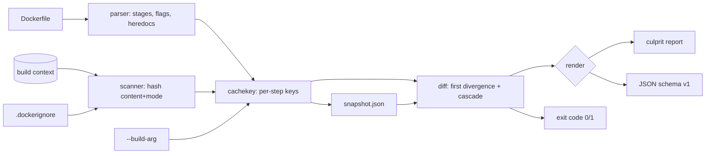

# buildbust

[English](README.md) | [中文](README.zh.md) | [日本語](README.ja.md)

[](LICENSE) [](go.mod) [](CHANGELOG.md)  [](CONTRIBUTING.md)

**buildbust：开源、零依赖的 CLI，精确告诉你是哪个文件、哪行 Dockerfile 弄坏了 Docker 构建缓存——它按指令对构建上下文做哈希，离线交出一份确定性的元凶报告。**


```bash
git clone https://github.com/JaydenCJ/buildbust && cd buildbust
go build -o buildbust ./cmd/buildbust    # single static binary, stdlib only
go install ./cmd/buildbust               # optional: put buildbust on your PATH
```

> 预发布说明：v0.1.0 尚未发布到任何包仓库；请按上述方式从源码构建（Go ≥1.22 即可）。

## 为什么选 buildbust？

每个有 Dockerfile 的团队都熟悉这套仪式：昨天还全量命中缓存的构建，今天重建了九层，CI 分钟数哗哗烧，有人嘀咕一句“八成是那个 COPY”，然后照猫画虎地往 `.dockerignore` 里再塞一行。你手头的工具回答不了*为什么*：`docker build --progress=plain` 只告诉你第 7 步 miss 了，绝不会说 `COPY src/ ./src/` 下 3000 个文件里到底哪个变了；`docker history` 和 `dive` 剖析的是你已经构建出来的镜像，层大小一应俱全，却对缓存键只字不提；BuildKit 的缓存内部结构离线又无从窥探。buildbust 从另一头下手：它离线重推构建器自己的失效规则——逐指令的键、每条 COPY/ADD 实际拉入文件的内容+权限哈希、ARG 作用域、`.dockerignore` 语义、跨 stage 的 `--from` 依赖边——先记录一份快照，下次运行时点名第一个发散的步骤、给出新旧摘要俱全的确切文件，以及因此重建的每一层。

| | buildbust | docker build --progress=plain | docker history | dive |
|---|---|---|---|---|
| 点名确切的失效文件（附摘要） | ✅ | ❌ | ❌ | ❌ |
| 钉死首个 miss 的 Dockerfile 行与步骤 | ✅ | ⚠️ 仅步骤，且要跑构建 | ❌ | ❌ |
| 解释 --build-arg 与 .dockerignore 的影响 | ✅ | ❌ | ❌ | ❌ |
| 跨多 stage `--from` 边的波及范围 | ✅ | ❌ | ❌ | ❌ |
| 离线可用，无需 Docker 守护进程 | ✅ | ❌ | ❌ | ⚠️ 需要镜像 |
| 供 CI 消费的机器可读报告 | ✅ JSON + 退出码 | ❌ 日志 | ⚠️ | ⚠️ |
| 运行时依赖 | 0 | 守护进程 | 守护进程 | Go 应用 + 镜像 |

<sub>核对于 2026-07-12：buildbust 只 import Go 标准库；层可视化工具都要求先有构建好的镜像，所以它们永远只能在你已经付过账之后解释这次重建。</sub>

## 功能特性

- **确定性的元凶报告** —— `explain` 点名第一个缓存 miss 的步骤、它的 Dockerfile 行号，对 COPY/ADD 还给出确切的变更文件：修改、新增、删除或仅 `chmod`，每个都附旧→新 sha256 摘要。
- **构建器真实的键模型，离线复刻** —— 逐指令键来自解析后的文本、内容+权限文件哈希（与 Docker 一样忽略 mtime）、由 stage ARG 值参与的 RUN 键、计入 heredoc 正文；连同与 BuildKit 的诚实差异一起写在 [docs/cache-model.md](docs/cache-model.md)。
- **不止归咎，还有波及范围** —— 看清每个 stage 有多少步骤要重建，包括被 `COPY --from` / `RUN --mount=from=` 依赖边拖下水的下游 stage，以及哪些仍然命中。
- **--build-arg 取证** —— 变更的 arg 会被归咎到第一个消费它的 RUN（Docker 的真实行为），证据形如 `name: "old" → "new"`，而不是归咎到 ARG 那一行。
- **深谙 .dockerignore** —— 完整的“最后匹配生效”语义，支持 `!` 重新纳入与 `**`，遵循 BuildKit 的 `<Dockerfile>.dockerignore` 优先级；当模式改动把文件拉进拉出时会打出嫌疑标记。
- **天生适配 CI** —— 稳定 JSON（`schema_version: 1`）、失效时退出码 1、同一次运行内用 `--update` 重置基线、对 git 友好的快照文件。
- **零依赖，完全离线** —— 只用 Go 标准库；没有守护进程、没有 registry、永远没有遥测。

## 快速上手

```bash
# fabricate a demo context (two-stage Node-style app with .dockerignore)
bash examples/make-demo-context.sh /tmp/buildbust-demo && cd /tmp/buildbust-demo
buildbust snapshot .                       # record the baseline
echo '// retry logic' >> src/lib/util.js   # someone edits one file…
buildbust explain .                        # …who busted the cache?
```

真实捕获的输出：

```text
buildbust explain — Dockerfile Dockerfile, context .

CACHE BUSTED at step 7/11 — stage "build", line 8

    8 | COPY src/ ./src/

  cause: build context changed under COPY sources [src]
    ~ modified      src/lib/util.js   6eff59ffb1c7 → 417cc1b60cd0

  blast radius: 4 of 11 steps rebuild, 7 stay cached
    stage build        steps 7-8    2 steps
    stage stage-2      steps 10-11  2 steps   via COPY --from=build (line 12)
```

想知道每条 COPY/ADD 的缓存键都吃进了什么（`buildbust files`，真实输出）：

```text
buildbust files — Dockerfile Dockerfile, context .

step 2  line 2  COPY package.json package-lock.json ./
  2 files, 70 B, digest 21560688cd8f
    0644  package-lock.json
    0644  package.json

step 6  line 7  COPY --from=deps /node_modules ./node_modules
  copies from stage "deps" (no context files)

step 7  line 8  COPY src/ ./src/
  2 files, 163 B, digest 6a94136b4496
    0644  src/lib/util.js
    0644  src/server.js

step 10  line 12  COPY --from=build /dist /srv/app
  copies from stage "build" (no context files)
```

## CLI 参考

`buildbust <snapshot|explain|files|version> [flags] [context]` —— 退出码：0 缓存完好，1 缓存失效，2 用法错误，3 运行时错误。

| 选项 | 默认值 | 作用 |
|---|---|---|
| `-f`, `--file` | `<context>/Dockerfile` | Dockerfile 路径 |
| `--dockerignore` | 自动探测 | ignore 文件（按 BuildKit 查找顺序） |
| `--build-arg NAME=val` | — | 构建期变量（可重复；为确定性考虑，绝不读进程环境变量） |
| `-o`（snapshot） | `<context>/.buildbust.json` | 快照输出路径 |
| `--against`（explain） | `<context>/.buildbust.json` | 用来对比的基线 |
| `--format`（explain、files） | `text` | `text` 或 `json` |
| `--update`（explain） | 关 | 解释完毕后重写基线 |

快照就是普通的缩进 JSON：把它提交到 Dockerfile 旁边，`explain` 就成了评审工具（“这个 PR 会弄坏依赖层”）。buildbust 在扫描自己的上下文时始终排除快照文件，所以它永远不会归咎自己。

## 验证

本仓库不附带任何 CI；上面的每一条断言都由本地运行来验证：

```bash
go test ./...            # 90 deterministic tests, offline, < 5 s
bash scripts/smoke.sh    # end-to-end CLI check, prints SMOKE OK
```

## 架构



## 路线图

- [x] v0.1.0 —— Dockerfile 解析器（heredoc、指令性注释、flags）、离线缓存键模型、`.dockerignore` 引擎、snapshot/explain/files 子命令、跨 stage 波及范围、90 个测试 + smoke 脚本
- [ ] `--since` git 模式：无需存储快照，直接解释两个 commit 之间的缓存失效
- [ ] 展开语法支持 BuildKit 字符串操作（`${V#prefix}`、`${V%suffix}`）
- [ ] 层大小标注：在有守护进程可用时，把元凶报告与 `docker history` 输出联表
- [ ] 监视模式：写 Dockerfile 时文件一变就重新解释
- [ ] registry 摘要固定检查（可选启用，唯一的联网功能——默认关闭）

完整列表见 [open issues](https://github.com/JaydenCJ/buildbust/issues)。

## 参与贡献

欢迎 issue、讨论与 PR —— 本地工作流（格式化、vet、测试、`SMOKE OK`）见 [CONTRIBUTING.md](CONTRIBUTING.md)。入门任务标注为 [good first issue](https://github.com/JaydenCJ/buildbust/issues?q=is%3Aissue+is%3Aopen+label%3A%22good+first+issue%22)，设计问题请到 [Discussions](https://github.com/JaydenCJ/buildbust/discussions)。

## 许可证

[MIT](LICENSE)
